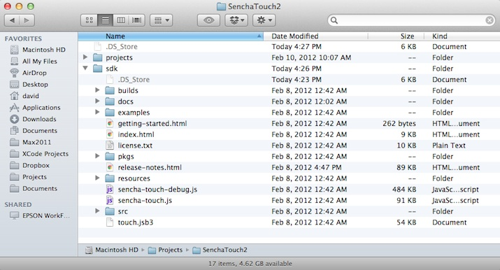

There are a few steps that need to be completed before starting serious Sencha Touch 2 development.  In this tutorial, I’ll highlight these items and walk you through step by step on completing them.  In addition to explaining the steps, I also provide a screencast that takes you through each item step by step.

>I’ve recently released the ST2 Power Tools which is an open source project aimed at helping developers be more productive with Sencha Touch 2.  You can read more about this here: [Introducing the ST2 Power Tools](/articles/introducing-st2-power-tools/)

##Summary

To properly setup your Mac for Sencha Touch 2 development, you need to accomplish three things: install the SDK, install compass / sass, and configure an alias for Apache on your machine.  Once these three steps are complete, you can actually begin developing a real Sencha Touch 2 application (which we’ll cover in the next tutorial).  I’ll walk you through each of these steps and then provide a full screencast walk-through at the end.

##Getting the SDK

The Sencha Touch 2 SDK can be obtained by going to the <a href="http://www.sencha.com/products/touch" target="_blank">Sencha Touch 2</a> site.  If you click on the download button, it will give you the option to download either the open-source version or the commercial release version for developers.  Once you download the SDK, you’ll need to unzip it.

Next, you’ll need to place it into a directory that you can utilize for your projects.  For this example, I am creating a `/Projects/SenchaTouch2` directory.  Inside of this directory I create two separate directories: projects and sdk.  You can put everything that was inside of the SDK zip file into the sdk directory you just created. Once complete, you should have a directory structure similar to the image below:

##Installing Compass and SASS
Sencha Touch 2 relies on SASS for its stylesheets, and it is a powerful tool that you should leverage in your stylesheets as well.  If you haven’t worked with SASS or Compass before, you probably don’t have the proper libraries installed.  To check, open a new Terminal window, and simply type compass.  If you see Command Not Found, then you don’t have compass installed.

Compass (and SASS) can be installed by simply typing the command below in a Terminal window:

	sudo gem install compass
	
Once compass is installed correctly, you should see the compass help text when you type compass in the command line.

##Configuring Apache

For your Sencha Touch 2 applications to work correctly, they need to be loaded from a webserver and not just the filesystem.  Luckily, Mac users have Apache already installed onto their machines, and it is easy to configure.  For our case, we simply want to expose our /Projects/SenchaTouch2 directory as an Alias in Apache.  In this way, we can type http://localhost/st2/ in our browser, and it will point to this directory.

To begin, you’ll need to edit the Apache configuration file.  This file can be found at `/etc/apache2/httpd.conf`.  For this example, I’ll use TextMate to edit the file (but any text editor will do).  With TextMate installed, I can open the file by typing:

	mate /etc/apache2/httpd.conf

Next, you will need to scroll to the end of the file.  Right before the last line, you will need to add in the following code which sets up the Alias (if you used a different directory - be sure to update the directory in both places in the config statement below):

Once this code is in place, you will need to restart Apache.  Open System Preferences and click on the Sharing option.  If Apache is currently running, you will see a check next to the Web Sharing option.  De-select and reselect this option to restart Apache.  If Apache isn’t running, simply select the option next to Web Sharing.

><b>NOTE:</b> Apache will have to have read permissions for every directory in the hierarchy of your Alias directory.  This is why it isn’t ideal to place your Sencha Touch 2 SDK and projects under your user directory (since your user directory is readable only to the owner and not Apache).  If you receive a Forbidden error, it may likely be due to a permissions issue.

If all works as expected, you should be able to go to the following URL to see the Sencha Touch 2 documentation:  http://localhost/st2/sdk/.

##Screencast
 

##Conclusion

Congratulations!  By following these steps, you are now ready to create your first Sencha Touch 2 project.  In the next tutorial, I will walk you through this process as well as how to use some tools that keep you productive.  Be sure to check out the following resource - [Introducing the ST2 Power Tools](/articles/introducing-st2-power-tools/)